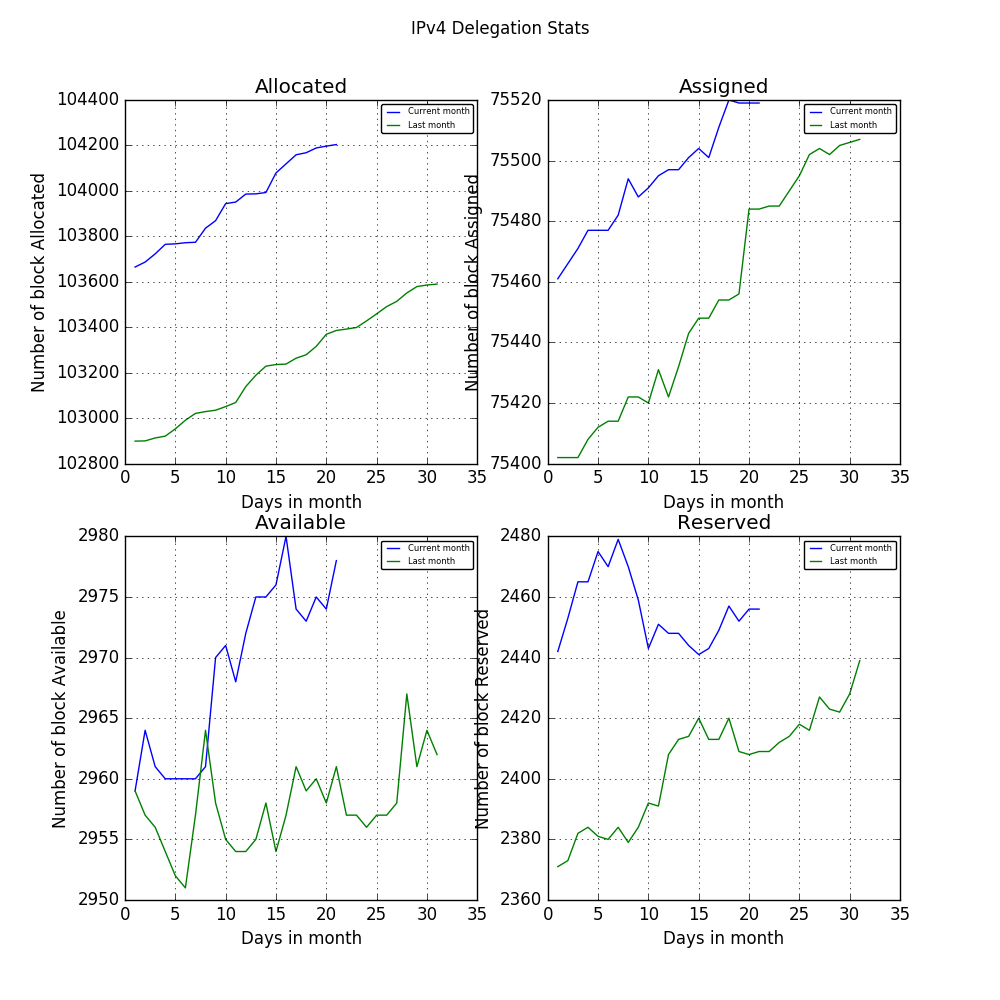
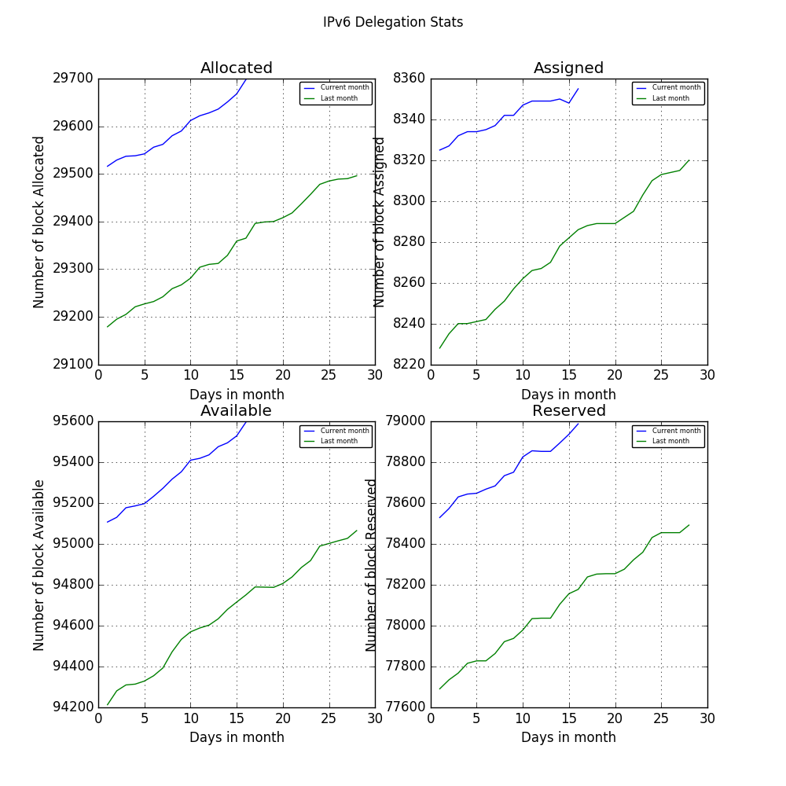

# IP Daily Digest - Global

Total IP delegations for the Globe. This is kept as a record for historical purposes. Data is taken from [APNIC FTP](https://ftp.apnic.net/)

Updated every 24 hours UTC 0:00

Links below take you to daily digests for a region.

[AFRINIC](./archives/AFRINIC/) | [APNIC](./archives/APNIC/) | [ARIN](./archives/ARIN/) | [LACNIC](./archives/LACNIC/) | [RIPE NCC](./archives/RIPE_NCC/)

---

## Digest for 2018-01-15
```
2018-01-15
==========
IPv4 | Allocated: 106,044 Assigned: 75,733 Available: 2,976 Reserved: 2,542 Hosts: 3,702,305,280
IPv6 | Allocated: 28,926 Assigned: 8,172 Available: 93,611 Reserved: 77,007
ASN  | Allocated: 49,875 Assigned: 25,739 Available: 4,828 Reserved: 1,929 Given: 95,219
```

### Detailed Report

### IPv4

#### Hosts: **3,702,305,280**

| Prefix | Allocated | Assigned | Available | Reserved |
| ----- | ----- | ----- | ----- | ----- |
| /30 | 0 | 0 | 0 | 0 |
| /29 | 0 | 14 | 1 | 0 |
| /28 | 0 | 8 | 0 | 0 |
| /27 | 0 | 37 | 5 | 0 |
| /26 | 2 | 40 | 8 | 0 |
| /25 | 2 | 70 | 23 | 0 |
| /24 | 7,577 ▲ +6 | 42,027 | 1,047 ▲ +1 | 765 ▲ +2 |
| /23 | 4,668 | 10,058 | 619 | 214 ▲ +1 |
| /22 | 40,353 ▲ +12 | 9,733 | 342 ▼ -1 | 824 ▼ -4 |
| /21 | 12,164 ▲ +2 | 2,751 | 231 ▼ -1 | 159 |
| /20 | 12,776 ▲ +1 | 2,130 | 122 ▲ +1 | 170 |
| /19 | 10,601 | 999 | 51 ▼ -1 | 69 |
| /18 | 5,089 | 440 | 25 | 26 |
| /17 | 3,256 | 214 | 5 | 11 |
| /16 | 5,519 | 6,291 | 9 | 72 ▼ -1 |
| /15 | 1,732 | 142 | 3 | 2 |
| /14 | 1,237 | 91 | 3 | 0 |
| /13 | 545 | 46 | 2 | 0 |
| /12 | 318 | 22 | 2 | 1 |
| /11 | 130 | 13 | 4 | 0 |
| /10 | 46 | 10 | 1 | 0 |
| /9 | 7 | 6 | 1 | 0 |
| /8 | 18 | 11 | 0 | 0 |
| **Total** | **106,044 ▲ +21** | **75,733** | **2,976 ▼ -1** | **2,542 ▲ +3** |



### IPv6

| Prefix | Allocated | Assigned | Available | Reserved |
| ----- | ----- | ----- | ----- | ----- |
| /64 | 0 | 3 | 1 | 2 |
| /63 | 0 | 0 | 1 | 0 |
| /62 | 0 | 0 | 0 | 0 |
| /61 | 0 | 0 | 1 | 0 |
| /60 | 0 | 0 | 1 | 0 |
| /59 | 0 | 0 | 1 | 0 |
| /58 | 0 | 0 | 1 | 0 |
| /57 | 0 | 0 | 1 | 0 |
| /56 | 0 | 0 | 1 | 0 |
| /55 | 0 | 0 | 1 | 0 |
| /54 | 0 | 0 | 1 | 0 |
| /53 | 0 | 0 | 1 | 0 |
| /52 | 0 | 0 | 1 | 0 |
| /51 | 0 | 0 | 1 | 0 |
| /50 | 0 | 0 | 1 | 0 |
| /49 | 0 | 0 | 1 | 0 |
| /48 | 138 | 6,643 | 1,937 | 4,299 |
| /47 | 2 | 110 | 1,984 | 4,091 |
| /46 | 1 | 48 | 1,990 | 1,827 |
| /45 | 2 | 30 | 1,995 | 1,778 |
| /44 | 10 | 623 | 3,053 | 580 |
| /43 | 1 | 12 | 2,982 | 566 |
| /42 | 0 | 19 | 2,986 | 580 |
| /41 | 0 | 12 | 2,981 | 590 |
| /40 | 6 | 378 | 2,606 | 360 |
| /39 | 0 | 1 | 2,064 | 351 |
| /38 | 0 | 1 | 2,061 | 345 |
| /37 | 0 | 1 | 2,051 | 346 |
| /36 | 356 | 100 | 1,377 | 479 |
| /35 | 113 | 3 | 896 | 467 |
| /34 | 55 | 0 | 86 | 462 |
| /33 | 57 | 0 | 73 | 462 |
| /32 | 20,570 ▲ +8 | 188 | 9,967 ▲ +7 | 11,741 ▲ +1 |
| /31 | 114 | 0 | 9,964 ▲ +7 | 11,240 ▲ +1 |
| /30 | 130 | 0 | 5,419 ▲ +1 | 11,342 ▲ +1 |
| /29 | 7,136 | 0 | 9,628 ▲ +2 | 10,798 ▲ +1 |
| /28 | 91 | 0 | 12,902 ▲ +2 | 7,080 |
| /27 | 19 | 0 | 8,564 ▲ +1 | 6,774 |
| /26 | 16 | 0 | 5,382 ▼ -1 | 182 ▼ -1 |
| /25 | 6 | 0 | 399 | 78 |
| /24 | 40 | 0 | 47 | 37 |
| **Total** | **28,926 ▲ +8** | **8,172** | **93,611 ▲ +19** | **77,007 ▲ +3** |

