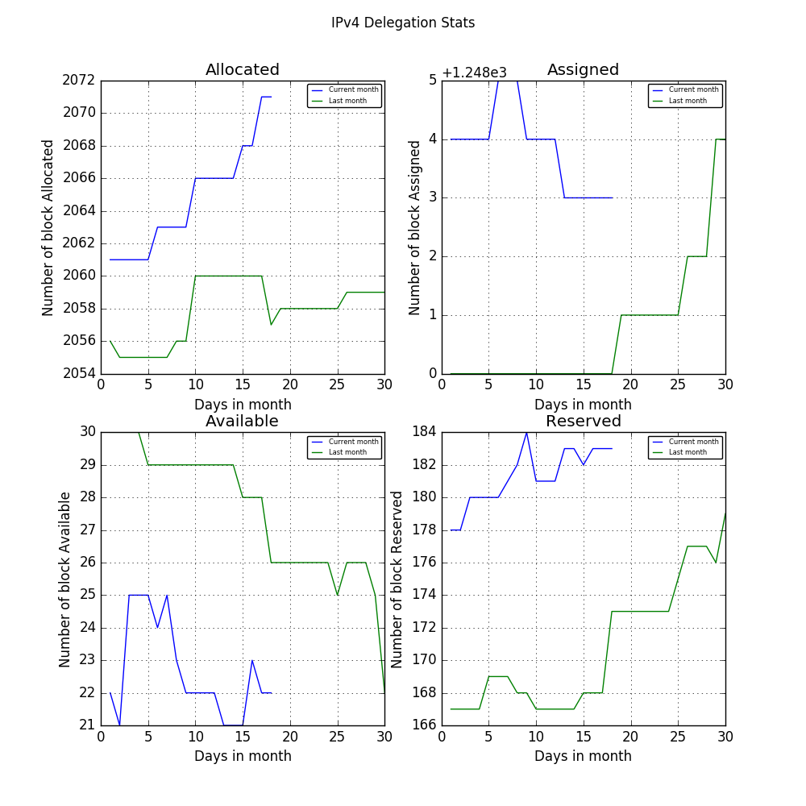
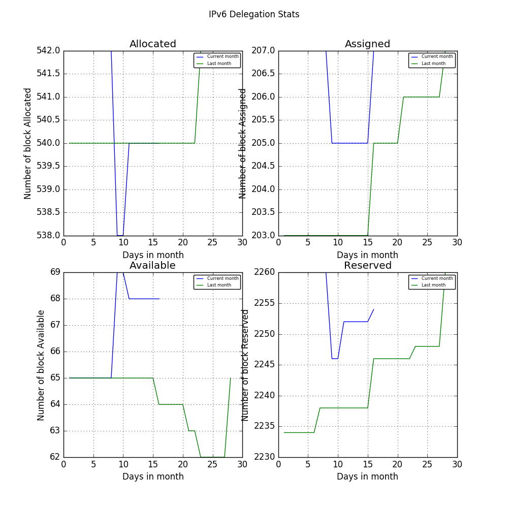

# IP Daily Digest - AFRINIC

Total IP delegations for AFRINIC. This is kept as a record for historical purposes. Data is taken from [APNIC FTP](https://ftp.apnic.net/)

[Global](https://github.com/csmets/IP-Daily-Digest) | [AFRINIC](https://github.com/csmets/IP-Daily-Digest/tree/master/archives/AFRINIC) | [APNIC](https://github.com/csmets/IP-Daily-Digest/tree/master/archives/APNIC) | [ARIN](https://github.com/csmets/IP-Daily-Digest/tree/master/archives/ARIN) | [LACNIC](https://github.com/csmets/IP-Daily-Digest/tree/master/archives/LACNIC) | [RIPE NCC](https://github.com/csmets/IP-Daily-Digest/tree/master/archives/RIPE_NCC)

---

## Digest for 2018-01-26
```
2018-01-26
==========
IPv4 | Allocated: 2,083 Assigned: 1,256 Available: 24 Reserved: 183 Hosts: 121,246,720
IPv6 | Allocated: 540 Assigned: 202 Available: 64 Reserved: 2,234
ASN  | Allocated: 1,567 Assigned: 0 Available: 506 Reserved: 229 Given: 2,302
```

### Detailed Report

### IPv4

#### Hosts: **121,246,720**

| Prefix | Allocated | Assigned | Available | Reserved |
| ----- | ----- | ----- | ----- | ----- |
| /30 | 0 | 0 | 0 | 0 |
| /29 | 0 | 0 | 0 | 0 |
| /28 | 0 | 0 | 0 | 0 |
| /27 | 0 | 0 | 0 | 0 |
| /26 | 0 | 0 | 0 | 0 |
| /25 | 0 | 0 | 0 | 0 |
| /24 | 0 | 884 ▲ +1 | 7 ▼ -1 | 43 ▲ +2 |
| /23 | 0 | 113 | 2 | 7 ▼ -1 |
| /22 | 694 ▲ +2 | 64 | 4 | 56 |
| /21 | 275 ▲ +1 | 23 | 2 ▲ +1 | 17 ▲ +3 |
| /20 | 279 | 30 | 1 ▼ -2 | 22 ▲ +1 |
| /19 | 303 ▲ +2 | 13 | 1 | 17 ▼ -1 |
| /18 | 150 | 10 | 0 | 10 ▼ -1 |
| /17 | 77 | 2 | 1 | 5 |
| /16 | 149 | 66 | 1 | 4 |
| /15 | 43 | 3 | 0 | 0 |
| /14 | 43 | 1 | 1 | 1 |
| /13 | 31 | 0 | 1 | 0 |
| /12 | 25 | 0 | 1 | 1 |
| /11 | 10 | 0 | 1 | 0 |
| /10 | 0 | 0 | 0 | 0 |
| /9 | 0 | 0 | 1 | 0 |
| /8 | 0 | 0 | 0 | 0 |
| **Total** | **2,083 ▲ +5** | **1,256 ▲ +1** | **24 ▼ -2** | **183 ▲ +3** |



### IPv6

| Prefix | Allocated | Assigned | Available | Reserved |
| ----- | ----- | ----- | ----- | ----- |
| /64 | 0 | 0 | 0 | 0 |
| /63 | 0 | 0 | 0 | 0 |
| /62 | 0 | 0 | 0 | 0 |
| /61 | 0 | 0 | 0 | 0 |
| /60 | 0 | 0 | 0 | 0 |
| /59 | 0 | 0 | 0 | 0 |
| /58 | 0 | 0 | 0 | 0 |
| /57 | 0 | 0 | 0 | 0 |
| /56 | 0 | 0 | 0 | 0 |
| /55 | 0 | 0 | 0 | 0 |
| /54 | 0 | 0 | 0 | 0 |
| /53 | 0 | 0 | 0 | 0 |
| /52 | 0 | 0 | 0 | 0 |
| /51 | 0 | 0 | 0 | 0 |
| /50 | 0 | 0 | 0 | 0 |
| /49 | 0 | 0 | 0 | 0 |
| /48 | 0 | 188 ▲ +2 | 0 | 138 ▲ +2 |
| /47 | 0 | 1 | 0 | 158 ▲ +2 |
| /46 | 0 | 3 | 0 | 162 ▲ +2 |
| /45 | 0 | 1 | 0 | 164 ▲ +2 |
| /44 | 0 | 6 | 13 | 5 |
| /43 | 0 | 0 | 0 ▼ -1 | 0 |
| /42 | 0 | 1 | 1 | 1 |
| /41 | 0 | 0 | 0 | 1 |
| /40 | 0 | 2 | 2 | 1 |
| /39 | 0 | 0 | 1 | 0 |
| /38 | 0 | 0 | 1 | 0 |
| /37 | 0 | 0 | 1 | 0 |
| /36 | 0 | 0 | 0 | 0 |
| /35 | 0 | 0 | 1 | 0 |
| /34 | 0 | 0 | 1 | 0 |
| /33 | 0 | 0 | 1 | 0 |
| /32 | 526 ▲ +2 | 0 | 1 | 524 ▲ +2 |
| /31 | 2 | 0 | 1 | 527 ▲ +2 |
| /30 | 0 | 0 | 1 | 527 ▲ +2 |
| /29 | 2 | 0 | 20 | 16 |
| /28 | 4 | 0 | 1 ▲ +1 | 0 |
| /27 | 2 | 0 | 0 ▼ -1 | 2 |
| /26 | 1 | 0 | 0 | 1 |
| /25 | 0 | 0 | 2 | 0 |
| /24 | 1 | 0 | 2 | 1 |
| **Total** | **540 ▲ +2** | **202 ▲ +2** | **64 ▼ -1** | **2,234 ▲ +14** |

