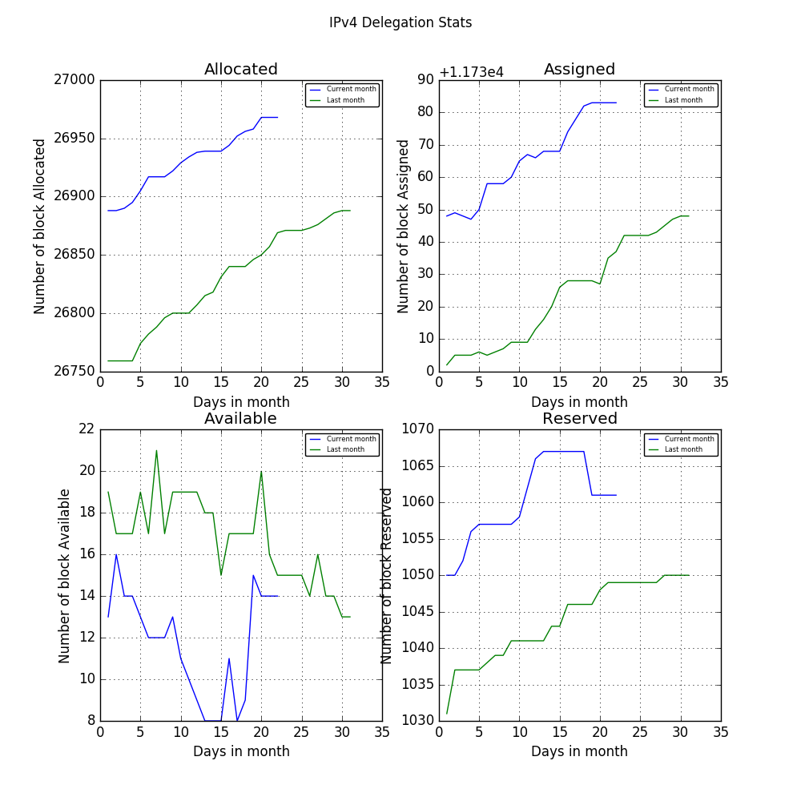
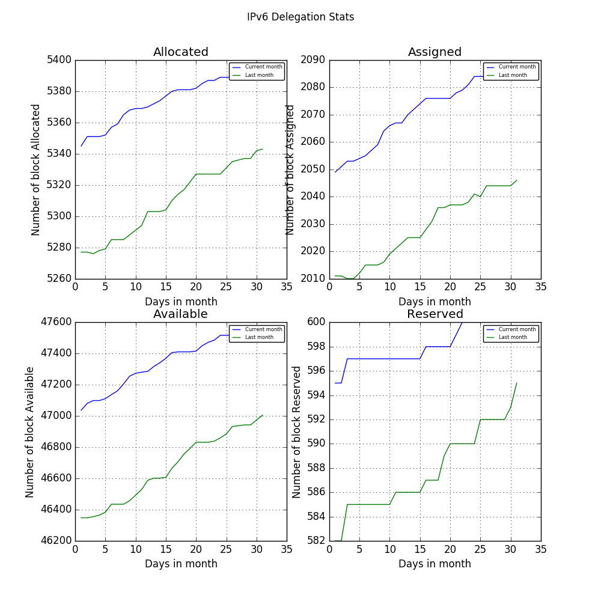

# IP Daily Digest - APNIC

Total IP delegations for APNIC. This is kept as a record for historical purposes. Data is taken from [APNIC FTP](https://ftp.apnic.net/)

[Global](https://github.com/csmets/IP-Daily-Digest) | [AFRINIC](https://github.com/csmets/IP-Daily-Digest/tree/master/archives/AFRINIC) | [APNIC](https://github.com/csmets/IP-Daily-Digest/tree/master/archives/APNIC) | [ARIN](https://github.com/csmets/IP-Daily-Digest/tree/master/archives/ARIN) | [LACNIC](https://github.com/csmets/IP-Daily-Digest/tree/master/archives/LACNIC) | [RIPE NCC](https://github.com/csmets/IP-Daily-Digest/tree/master/archives/RIPE_NCC)

---

## Digest for 2017-12-06
```
2017-12-06
==========
IPv4 | Allocated: 26,782 Assigned: 11,735 Available: 17 Reserved: 1,038 Hosts: 882,417,920
IPv6 | Allocated: 5,223 Assigned: 1,975 Available: 45,802 Reserved: 577
ASN  | Allocated: 8,109 Assigned: 0 Available: 468 Reserved: 0 Given: 14,985
```

### Detailed Report

### IPv4

#### Hosts: **882,417,920 ▲ +4096**

| Prefix | Allocated | Assigned | Available | Reserved |
| ----- | ----- | ----- | ----- | ----- |
| /30 | 0 | 0 | 0 | 0 |
| /29 | 0 | 0 | 0 | 0 |
| /28 | 0 | 0 | 0 | 0 |
| /27 | 0 | 0 | 0 | 0 |
| /26 | 0 | 0 | 0 | 0 |
| /25 | 0 | 0 | 0 | 0 |
| /24 | 2,190 ▲ +1 | 6,361 ▼ -1 | 5 ▼ -1 | 477 ▲ +1 |
| /23 | 1,463 | 1,985 | 1 | 75 |
| /22 | 12,502 ▲ +6 | 3,343 | 1 | 386 |
| /21 | 1,850 | 27 | 1 ▲ +1 | 24 |
| /20 | 2,022 ▲ +1 | 9 | 2 ▼ -2 | 9 |
| /19 | 1,820 | 5 | 1 | 9 |
| /18 | 992 | 2 | 1 | 4 |
| /17 | 749 | 2 | 1 | 2 |
| /16 | 1,714 | 1 | 0 | 52 |
| /15 | 616 | 0 | 1 | 0 |
| /14 | 445 | 0 | 1 | 0 |
| /13 | 227 | 0 | 0 | 0 |
| /12 | 119 | 0 | 1 | 0 |
| /11 | 50 | 0 | 0 | 0 |
| /10 | 20 | 0 | 1 | 0 |
| /9 | 1 | 0 | 0 | 0 |
| /8 | 2 | 0 | 0 | 0 |
| **Total** | **26,782 ▲ +8** | **11,735 ▼ -1** | **17 ▼ -2** | **1,038 ▲ +1** |



### IPv6

| Prefix | Allocated | Assigned | Available | Reserved |
| ----- | ----- | ----- | ----- | ----- |
| /64 | 0 | 3 | 1 | 2 |
| /63 | 0 | 0 | 1 | 0 |
| /62 | 0 | 0 | 0 | 0 |
| /61 | 0 | 0 | 1 | 0 |
| /60 | 0 | 0 | 1 | 0 |
| /59 | 0 | 0 | 1 | 0 |
| /58 | 0 | 0 | 1 | 0 |
| /57 | 0 | 0 | 1 | 0 |
| /56 | 0 | 0 | 1 | 0 |
| /55 | 0 | 0 | 1 | 0 |
| /54 | 0 | 0 | 1 | 0 |
| /53 | 0 | 0 | 1 | 0 |
| /52 | 0 | 0 | 1 | 0 |
| /51 | 0 | 0 | 1 | 0 |
| /50 | 0 | 0 | 1 | 0 |
| /49 | 0 | 0 | 1 | 0 |
| /48 | 0 | 1,902 ▲ +1 | 1,423 ▲ +1 | 162 |
| /47 | 0 | 30 | 1,461 ▲ +1 | 1 |
| /46 | 0 | 8 | 1,468 ▲ +1 | 2 |
| /45 | 0 | 3 | 1,472 ▲ +1 | 1 |
| /44 | 0 | 8 | 1,474 ▲ +1 | 0 |
| /43 | 0 | 2 | 1,477 ▲ +1 | 2 |
| /42 | 0 | 1 | 1,479 ▲ +1 | 1 |
| /41 | 0 | 0 | 1,480 ▲ +1 | 1 |
| /40 | 0 | 2 | 611 ▼ -1 | 0 |
| /39 | 0 | 0 | 24 | 0 |
| /38 | 0 | 0 | 24 | 0 |
| /37 | 0 | 0 | 24 | 0 |
| /36 | 0 | 0 | 24 | 0 |
| /35 | 111 | 0 | 29 | 6 |
| /34 | 55 | 0 | 29 | 1 |
| /33 | 55 | 0 | 13 | 1 |
| /32 | 4,898 ▲ +5 | 16 | 5,082 ▲ +5 | 304 |
| /31 | 25 | 0 | 5,138 ▲ +5 | 13 |
| /30 | 15 | 0 | 5,157 ▲ +5 | 14 |
| /29 | 12 | 0 | 4,950 ▲ +5 | 7 |
| /28 | 11 | 0 | 4,955 ▲ +5 | 9 |
| /27 | 4 | 0 | 4,951 ▲ +5 | 9 |
| /26 | 7 | 0 | 2,963 ▼ -5 | 11 |
| /25 | 2 | 0 | 3 | 11 |
| /24 | 7 | 0 | 5 | 8 |
| **Total** | **5,223 ▲ +5** | **1,975 ▲ +1** | **45,802 ▲ +32** | **577** |

