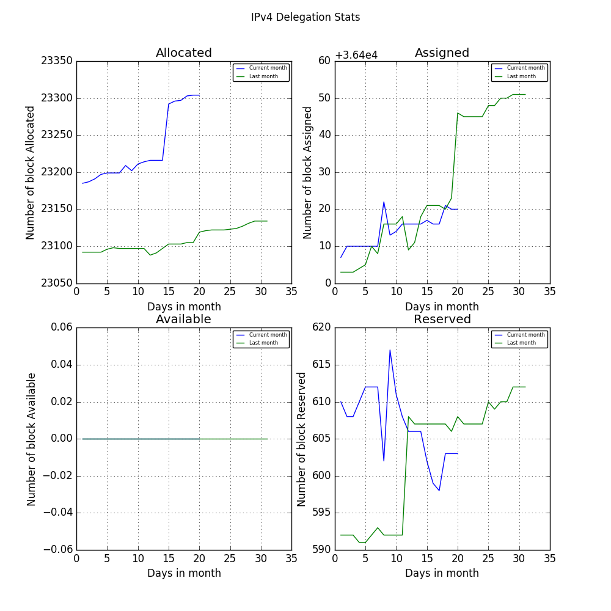
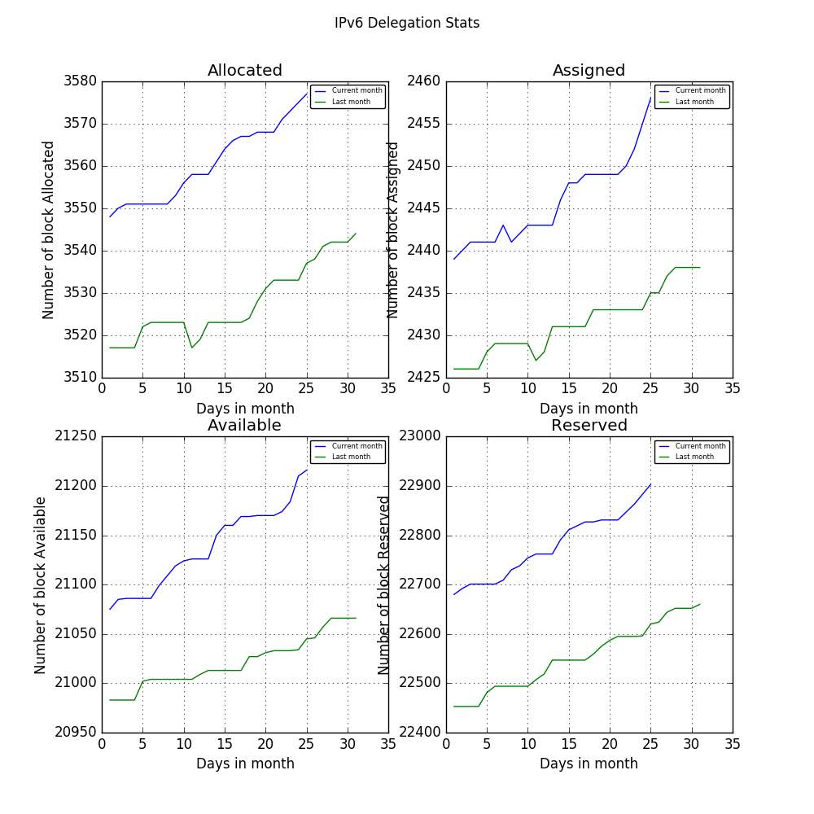

# IP Daily Digest - ARIN 

Total IP delegations for ARIN. This is kept as a record for historical purposes. Data is taken from [APNIC FTP](https://ftp.apnic.net/)

[Global](https://github.com/csmets/IP-Daily-Digest) | [AFRINIC](https://github.com/csmets/IP-Daily-Digest/tree/master/archives/AFRINIC) | [APNIC](https://github.com/csmets/IP-Daily-Digest/tree/master/archives/APNIC) | [ARIN](https://github.com/csmets/IP-Daily-Digest/tree/master/archives/ARIN) | [LACNIC](https://github.com/csmets/IP-Daily-Digest/tree/master/archives/LACNIC) | [RIPE NCC](https://github.com/csmets/IP-Daily-Digest/tree/master/archives/RIPE_NCC)

---

## Digest for 2017-10-18
```
2017-10-18
==========
IPv4 | Allocated: 23,105 Assigned: 36,420 Available: 0 Reserved: 607 Hosts: 1,685,755,904
IPv6 | Allocated: 3,445 Assigned: 2,393 Available: 20,744 Reserved: 22,024
ASN  | Allocated: 0 Assigned: 25,610 Available: 322 Reserved: 900 Given: 29,525
```

### Detailed Report

### IPv4

#### Hosts: **1,685,755,904 ▲ +65536**

| Prefix | Allocated | Assigned | Available | Reserved |
| ----- | ----- | ----- | ----- | ----- |
| /30 | 0 | 0 | 0 | 0 |
| /29 | 0 | 0 | 0 | 0 |
| /28 | 0 | 0 | 0 | 0 |
| /27 | 0 | 0 | 0 | 0 |
| /26 | 0 | 0 | 0 | 0 |
| /25 | 0 | 0 | 0 | 0 |
| /24 | 2,733 | 22,029 | 0 | 123 |
| /23 | 1,570 ▲ +1 | 3,117 ▼ -1 | 0 | 84 |
| /22 | 4,071 | 2,841 | 0 | 84 |
| /21 | 2,530 | 1,328 | 0 | 46 |
| /20 | 4,048 | 1,264 | 0 | 43 |
| /19 | 3,012 | 558 | 0 | 22 |
| /18 | 1,570 | 285 | 0 | 7 |
| /17 | 849 | 145 | 0 | 2 |
| /16 | 1,691 ▲ +1 | 4,596 | 0 | 16 |
| /15 | 422 | 92 | 0 | 1 |
| /14 | 285 | 72 | 0 | 0 |
| /13 | 136 | 42 | 0 | 0 |
| /12 | 101 | 18 | 0 | 0 |
| /11 | 44 | 12 | 0 | 0 |
| /10 | 20 | 7 | 0 | 0 |
| /9 | 7 | 5 | 0 | 0 |
| /8 | 16 | 9 | 0 | 0 |
| **Total** | **23,105 ▲ +2** | **36,420 ▼ -1** | **0** | **607** |



### IPv6

| Prefix | Allocated | Assigned | Available | Reserved |
| ----- | ----- | ----- | ----- | ----- |
| /64 | 0 | 0 | 0 | 0 |
| /63 | 0 | 0 | 0 | 0 |
| /62 | 0 | 0 | 0 | 0 |
| /61 | 0 | 0 | 0 | 0 |
| /60 | 0 | 0 | 0 | 0 |
| /59 | 0 | 0 | 0 | 0 |
| /58 | 0 | 0 | 0 | 0 |
| /57 | 0 | 0 | 0 | 0 |
| /56 | 0 | 0 | 0 | 0 |
| /55 | 0 | 0 | 0 | 0 |
| /54 | 0 | 0 | 0 | 0 |
| /53 | 0 | 0 | 0 | 0 |
| /52 | 0 | 0 | 0 | 0 |
| /51 | 0 | 0 | 0 | 0 |
| /50 | 0 | 0 | 0 | 0 |
| /49 | 0 | 0 | 0 | 0 |
| /48 | 133 | 1,278 | 67 | 1,362 |
| /47 | 2 | 23 | 72 | 1,303 |
| /46 | 1 | 16 | 67 | 1,312 |
| /45 | 1 | 15 | 64 | 1,319 |
| /44 | 6 | 556 | 1,248 | 533 |
| /43 | 1 | 8 | 1,206 | 529 |
| /42 | 0 | 12 | 1,207 | 541 |
| /41 | 0 | 11 | 1,206 | 551 |
| /40 | 4 | 347 | 1,749 | 346 |
| /39 | 0 | 0 | 1,746 | 339 |
| /38 | 0 | 1 | 1,743 | 334 |
| /37 | 0 | 1 | 1,732 | 335 |
| /36 | 334 | 93 | 1,249 | 450 |
| /35 | 2 | 0 | 833 | 435 |
| /34 | 0 | 0 | 7 | 435 |
| /33 | 2 | 0 | 7 | 435 |
| /32 | 2,800 ▲ +2 | 32 | 16 | 3,032 ▲ +2 |
| /31 | 27 | 0 | 11 | 2,943 ▲ +2 |
| /30 | 8 | 0 | 12 | 2,949 ▲ +2 |
| /29 | 13 | 0 | 60 | 2,254 ▲ +2 |
| /28 | 61 | 0 | 2,267 ▲ +2 | 47 |
| /27 | 2 | 0 | 2,272 ▲ +2 | 44 |
| /26 | 0 | 0 | 1,795 ▼ -2 | 43 |
| /25 | 0 | 0 | 22 | 42 |
| /24 | 23 | 0 | 30 | 11 |
| **Total** | **3,445 ▲ +2** | **2,393** | **20,744 ▲ +2** | **22,024 ▲ +8** |

