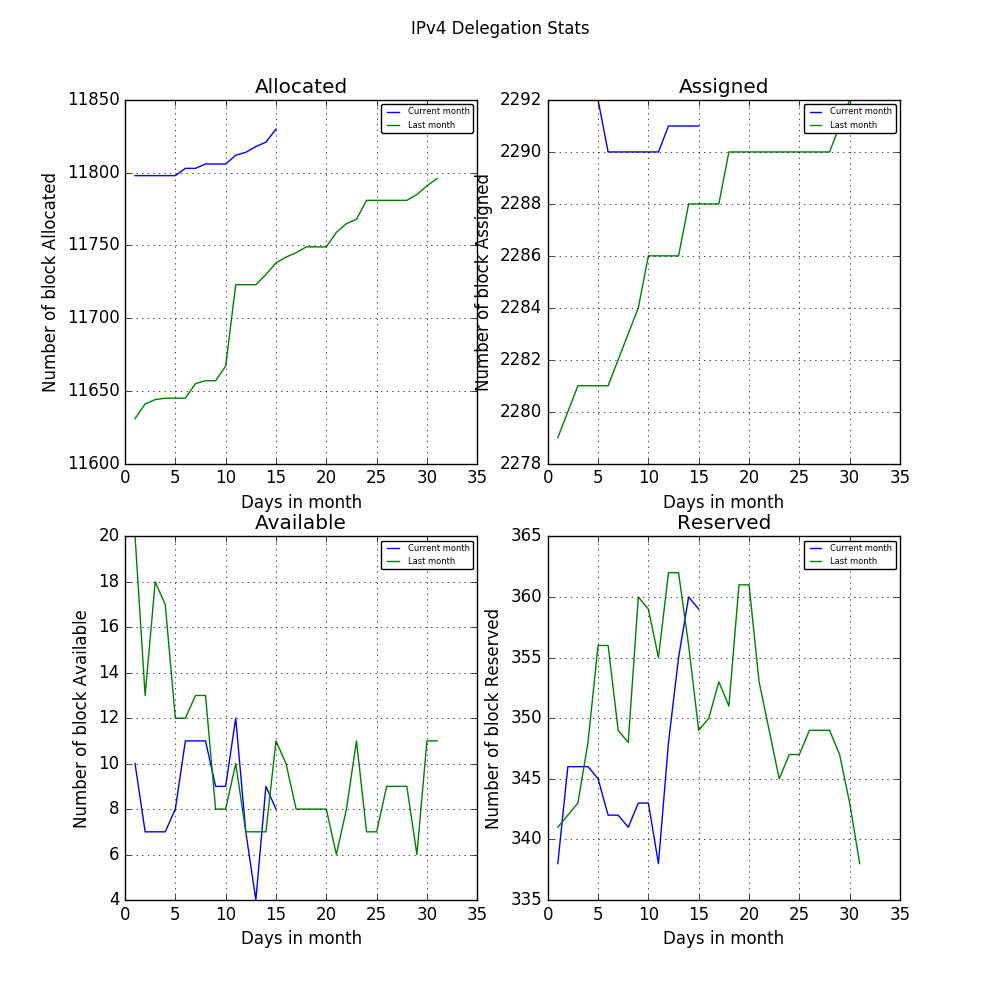
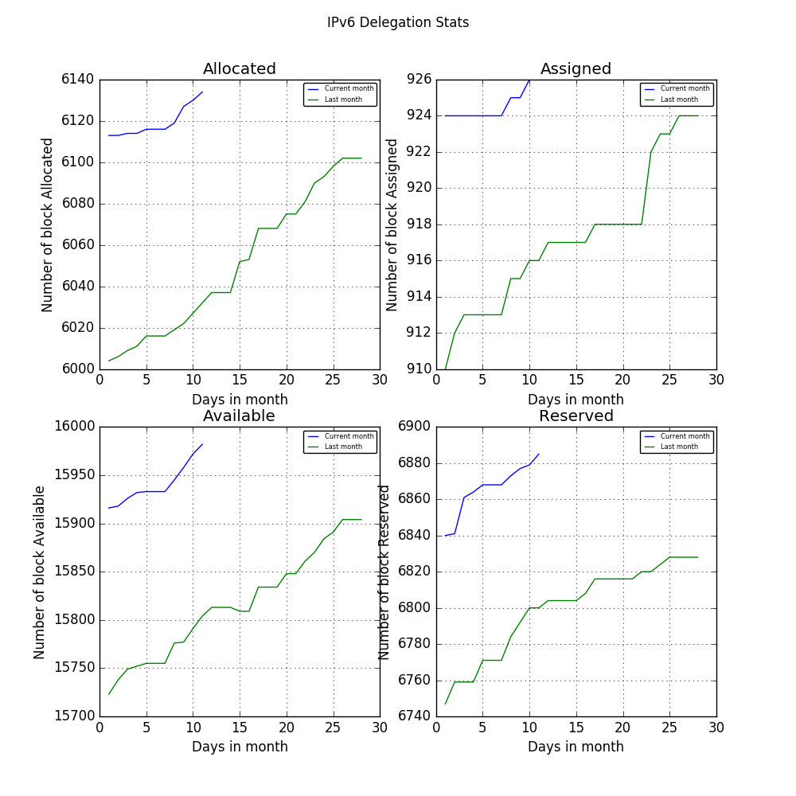

# IP Daily Digest - LANIC

Total IP delegations for LACNIC. This is kept as a record for historical purposes. Data is taken from [APNIC FTP](https://ftp.apnic.net/)

[Global](https://github.com/csmets/IP-Daily-Digest) | [AFRINIC](https://github.com/csmets/IP-Daily-Digest/tree/master/archives/AFRINIC) | [APNIC](https://github.com/csmets/IP-Daily-Digest/tree/master/archives/APNIC) | [ARIN](https://github.com/csmets/IP-Daily-Digest/tree/master/archives/ARIN) | [LACNIC](https://github.com/csmets/IP-Daily-Digest/tree/master/archives/LACNIC) | [RIPE NCC](https://github.com/csmets/IP-Daily-Digest/tree/master/archives/RIPE_NCC)

---

## Digest for 2017-11-03
```
2017-11-03
==========
IPv4 | Allocated: 11,538 Assigned: 2,272 Available: 13 Reserved: 359 Hosts: 190,779,648
IPv6 | Allocated: 5,723 Assigned: 879 Available: 15,154 Reserved: 6,300
ASN  | Allocated: 7,619 Assigned: 0 Available: 177 Reserved: 143 Given: 9,983
```

### Detailed Report

### IPv4

#### Hosts: **190,779,648**

| Prefix | Allocated | Assigned | Available | Reserved |
| ----- | ----- | ----- | ----- | ----- |
| /30 | 0 | 0 | 0 | 0 |
| /29 | 0 | 0 | 0 | 0 |
| /28 | 0 | 0 | 0 | 0 |
| /27 | 0 | 0 | 0 | 0 |
| /26 | 0 | 0 | 0 | 0 |
| /25 | 0 | 0 | 0 | 0 |
| /24 | 42 ▲ +1 | 1,271 | 1 | 39 ▲ +1 |
| /23 | 42 ▲ +3 | 289 ▲ +1 | 0 | 19 ▲ +1 |
| /22 | 6,022 ▲ +7 | 252 | 3 | 142 ▲ +10 |
| /21 | 1,241 | 64 | 3 | 50 |
| /20 | 1,955 ▼ -1 | 155 | 1 | 84 |
| /19 | 740 | 45 | 0 | 16 |
| /18 | 374 | 40 | 1 ▲ +1 | 5 |
| /17 | 297 | 8 | 0 ▼ -1 | 3 |
| /16 | 400 | 145 | 1 | 0 |
| /15 | 191 | 3 | 0 | 1 |
| /14 | 195 | 0 | 1 | 0 |
| /13 | 21 | 0 | 1 | 0 |
| /12 | 15 | 0 | 0 | 0 |
| /11 | 3 | 0 | 1 | 0 |
| /10 | 0 | 0 | 0 | 0 |
| /9 | 0 | 0 | 0 | 0 |
| /8 | 0 | 0 | 0 | 0 |
| **Total** | **11,538 ▲ +10** | **2,272 ▲ +1** | **13** | **359 ▲ +12** |



### IPv6

| Prefix | Allocated | Assigned | Available | Reserved |
| ----- | ----- | ----- | ----- | ----- |
| /64 | 0 | 0 | 0 | 0 |
| /63 | 0 | 0 | 0 | 0 |
| /62 | 0 | 0 | 0 | 0 |
| /61 | 0 | 0 | 0 | 0 |
| /60 | 0 | 0 | 0 | 0 |
| /59 | 0 | 0 | 0 | 0 |
| /58 | 0 | 0 | 0 | 0 |
| /57 | 0 | 0 | 0 | 0 |
| /56 | 0 | 0 | 0 | 0 |
| /55 | 0 | 0 | 0 | 0 |
| /54 | 0 | 0 | 0 | 0 |
| /53 | 0 | 0 | 0 | 0 |
| /52 | 0 | 0 | 0 | 0 |
| /51 | 0 | 0 | 0 | 0 |
| /50 | 0 | 0 | 0 | 0 |
| /49 | 0 | 0 | 0 | 0 |
| /48 | 1 | 658 | 380 | 293 |
| /47 | 0 | 11 ▲ +1 | 389 ▲ +1 | 254 |
| /46 | 0 | 5 | 385 ▲ +1 | 256 |
| /45 | 0 | 6 | 395 ▲ +1 | 256 |
| /44 | 0 | 29 | 239 ▲ +1 | 11 |
| /43 | 0 | 1 | 218 ▲ +1 | 10 |
| /42 | 0 | 2 | 219 ▲ +1 | 11 |
| /41 | 0 | 1 | 215 ▼ -1 | 12 |
| /40 | 0 | 17 | 246 | 2 |
| /39 | 0 | 1 | 241 | 2 |
| /38 | 0 | 0 | 241 | 2 |
| /37 | 0 | 0 | 240 | 2 |
| /36 | 0 | 8 | 82 | 1 |
| /35 | 0 | 3 | 42 | 1 |
| /34 | 0 | 0 | 42 | 1 |
| /33 | 0 | 0 | 42 | 1 |
| /32 | 5,674 ▲ +4 | 137 | 4,602 ▲ +3 | 1,402 ▲ +1 |
| /31 | 11 | 0 | 4,549 ▲ +3 | 1,263 ▲ +1 |
| /30 | 13 | 0 | 165 ▼ -1 | 1,264 ▲ +1 |
| /29 | 9 | 0 | 80 ▲ +1 | 1,250 ▲ +1 |
| /28 | 10 | 0 | 1,130 ▲ +2 | 6 |
| /27 | 0 | 0 | 929 | 0 |
| /26 | 0 | 0 | 12 ▲ +1 | 0 |
| /25 | 0 | 0 | 10 ▲ +1 | 0 |
| /24 | 4 | 0 | 10 ▲ +1 | 0 |
| **Total** | **5,723 ▲ +4** | **879 ▲ +1** | **15,154 ▲ +15** | **6,300 ▲ +4** |

