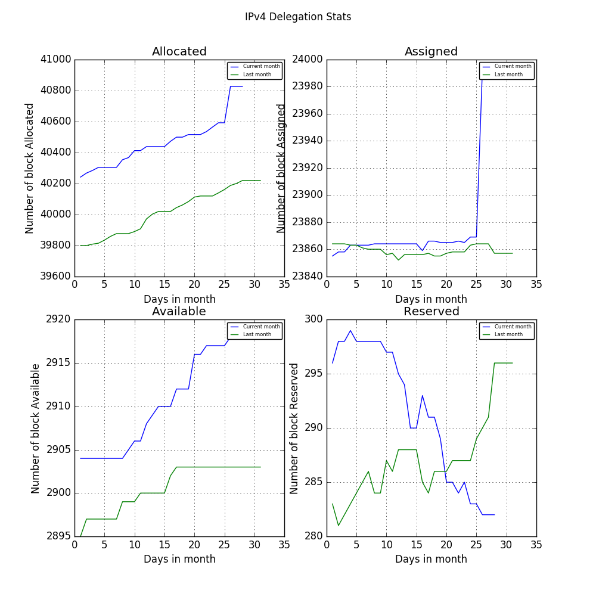
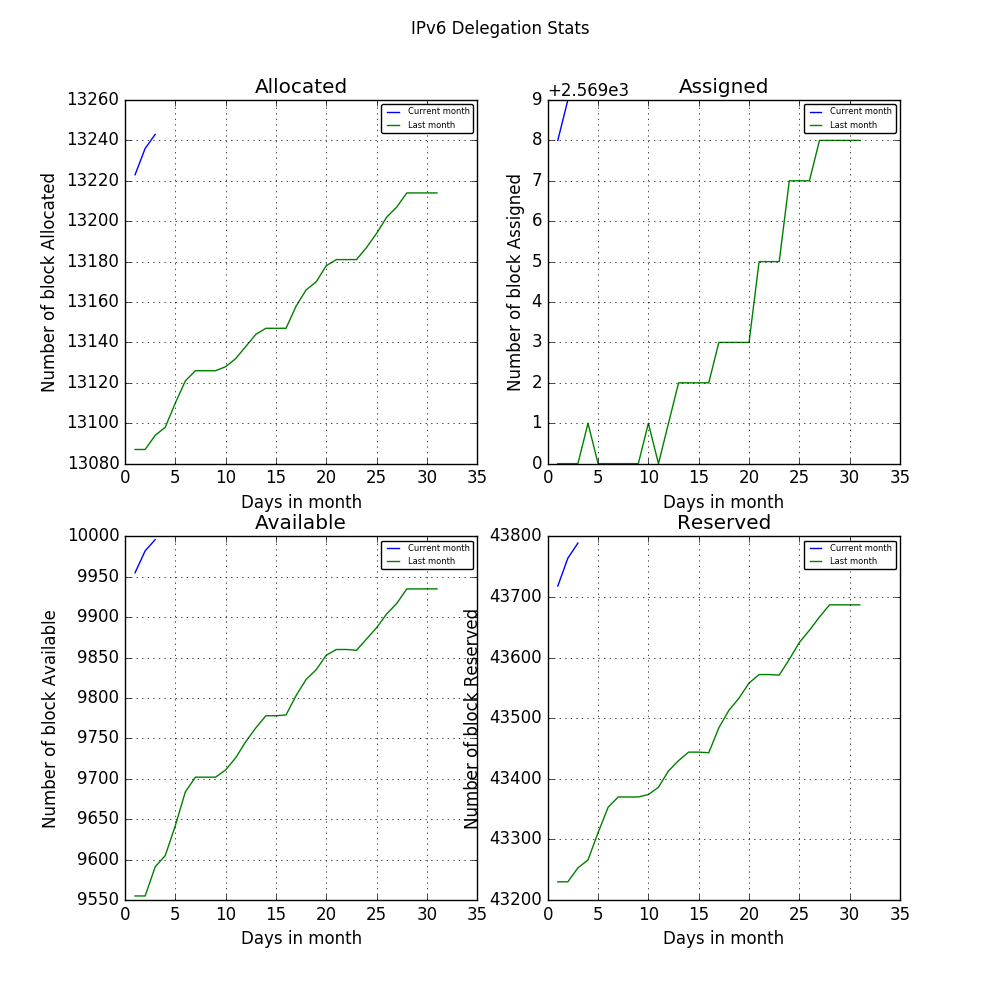

# IP Daily Digest - RIPE NCC

Total IP delegations for RIPE NCC. This is kept as a record for historical purposes. Data is taken from [APNIC FTP](https://ftp.apnic.net/)

[Global](https://github.com/csmets/IP-Daily-Digest) | [AFRINIC](https://github.com/csmets/IP-Daily-Digest/tree/master/archives/AFRINIC) | [APNIC](https://github.com/csmets/IP-Daily-Digest/tree/master/archives/APNIC) | [ARIN](https://github.com/csmets/IP-Daily-Digest/tree/master/archives/ARIN) | [LACNIC](https://github.com/csmets/IP-Daily-Digest/tree/master/archives/LACNIC) | [RIPE NCC](https://github.com/csmets/IP-Daily-Digest/tree/master/archives/RIPE_NCC)

---

## Digest for 2017-10-23
```
2017-10-23
==========
IPv4 | Allocated: 40,119 Assigned: 23,858 Available: 2,903 Reserved: 287 Hosts: 822,359,040
IPv6 | Allocated: 13,181 Assigned: 2,574 Available: 9,859 Reserved: 43,571
ASN  | Allocated: 31,914 Assigned: 0 Available: 3,906 Reserved: 556 Given: 36,376
```

### Detailed Report

### IPv4

#### Hosts: **822,359,040**

| Prefix | Allocated | Assigned | Available | Reserved |
| ----- | ----- | ----- | ----- | ----- |
| /30 | 0 | 0 | 0 | 0 |
| /29 | 0 | 14 | 1 | 0 |
| /28 | 0 | 8 | 0 | 0 |
| /27 | 0 | 37 | 5 | 0 |
| /26 | 0 | 40 | 9 | 1 |
| /25 | 1 | 70 | 24 | 0 |
| /24 | 2,245 | 11,293 | 1,014 | 76 |
| /23 | 1,390 | 4,520 | 614 | 16 |
| /22 | 15,721 | 3,203 | 336 | 151 |
| /21 | 6,190 | 1,317 | 223 | 24 |
| /20 | 4,436 | 665 | 117 | 12 |
| /19 | 4,708 | 380 | 50 | 3 |
| /18 | 1,882 | 101 | 23 | 0 |
| /17 | 1,222 | 56 | 2 | 0 |
| /16 | 1,458 | 1,554 | 7 | 2 |
| /15 | 416 | 42 | 3 | 1 |
| /14 | 241 | 15 | 2 | 0 |
| /13 | 117 | 6 | 1 | 1 |
| /12 | 57 | 3 | 1 | 0 |
| /11 | 24 | 0 | 1 | 0 |
| /10 | 10 | 0 | 0 | 0 |
| /9 | 1 | 0 | 0 | 0 |
| /8 | 0 | 3 | 0 | 0 |
| **Total** | **40,119** | **23,858** | **2,903** | **287** |



### IPv6

| Prefix | Allocated | Assigned | Available | Reserved |
| ----- | ----- | ----- | ----- | ----- |
| /64 | 0 | 0 | 0 | 0 |
| /63 | 0 | 0 | 0 | 0 |
| /62 | 0 | 0 | 0 | 0 |
| /61 | 0 | 0 | 0 | 0 |
| /60 | 0 | 0 | 0 | 0 |
| /59 | 0 | 0 | 0 | 0 |
| /58 | 0 | 0 | 0 | 0 |
| /57 | 0 | 0 | 0 | 0 |
| /56 | 0 | 0 | 0 | 0 |
| /55 | 0 | 0 | 0 | 0 |
| /54 | 0 | 0 | 0 | 0 |
| /53 | 0 | 0 | 0 | 0 |
| /52 | 0 | 0 | 0 | 0 |
| /51 | 0 | 0 | 0 | 0 |
| /50 | 0 | 0 | 0 | 0 |
| /49 | 0 | 0 | 0 | 0 |
| /48 | 0 | 2,506 | 3 | 2,295 |
| /47 | 0 | 38 | 1 | 2,331 |
| /46 | 0 | 16 | 3 | 85 |
| /45 | 0 | 6 | 1 | 22 |
| /44 | 0 | 2 | 3 | 8 |
| /43 | 0 | 1 | 3 | 3 |
| /42 | 0 | 1 | 3 | 2 |
| /41 | 0 | 0 | 3 | 1 |
| /40 | 0 | 1 | 3 | 1 |
| /39 | 0 | 0 | 4 | 1 |
| /38 | 0 | 0 | 3 | 0 |
| /37 | 0 | 0 | 5 | 0 |
| /36 | 0 | 0 | 5 | 0 |
| /35 | 0 | 0 | 4 | 0 |
| /34 | 0 | 0 | 5 | 0 |
| /33 | 0 | 0 | 5 | 0 |
| /32 | 6,318 | 3 | 3 | 6,317 |
| /31 | 49 | 0 | 2 | 6,366 |
| /30 | 91 | 0 | 0 | 6,457 |
| /29 | 6,677 | 0 | 4,446 ▼ -1 | 6,678 ▼ -1 |
| /28 | 5 | 0 | 4,347 ▼ -1 | 6,568 |
| /27 | 11 | 0 | 336 ▲ +1 | 6,266 |
| /26 | 8 | 0 | 242 | 95 |
| /25 | 4 | 0 | 166 | 25 |
| /24 | 5 | 0 | 165 | 17 |
| **Total** | **13,181** | **2,574** | **9,859 ▼ -1** | **43,571 ▼ -1** |

